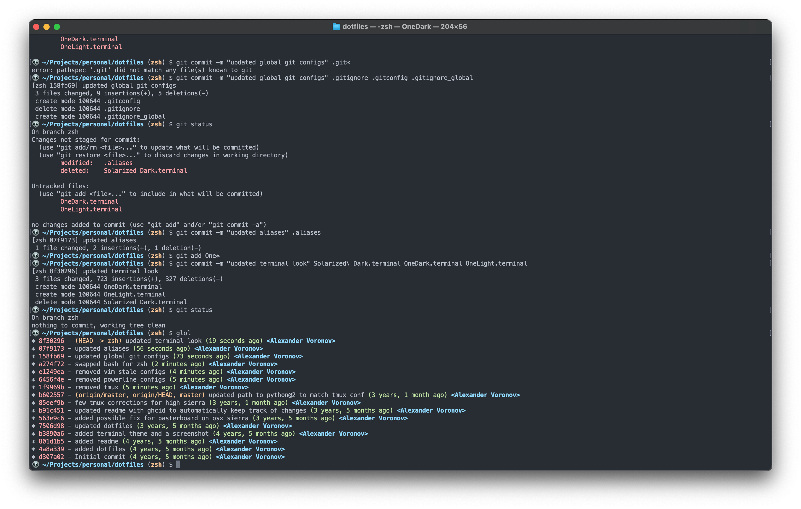
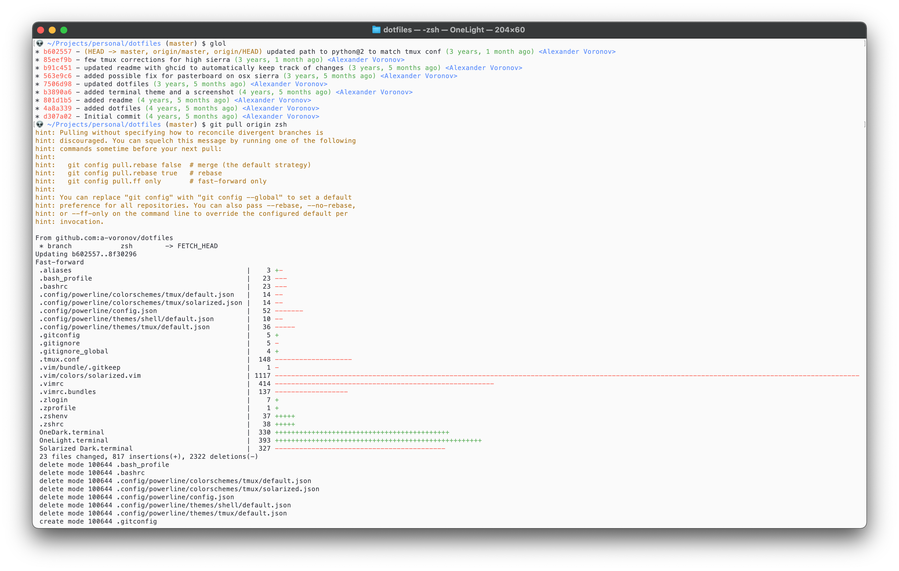

# Dotfiles 👽
---
My personal dotfiles for zsh terminal on OS X 11+ with OneLight and OneDark color schemes.

| OneDark | OneLight |
| - | - |
|  |  |

## Install

Copy dotfiles to your $HOME directory.

* You'll probably want [ brew ]( http://brew.sh ) installed (though I'm still planning to use [ nix ]( https://nixos.org )  for managing dependencies).

    ```
    /bin/bash -c "$(curl -fsSL https://raw.githubusercontent.com/Homebrew/install/HEAD/install.sh)"
    ```

* To apply macOS settings and Terminal color themes, run:

    ```
    sh .macos
    ```
