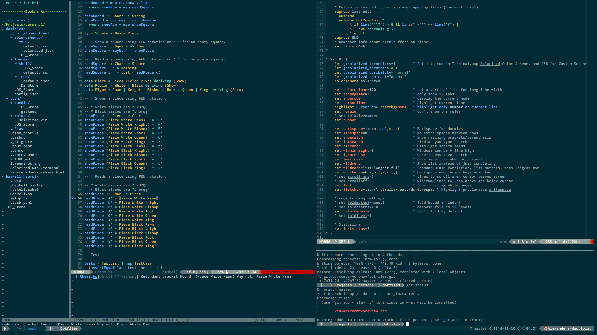

# Dotfiles 👽
---
My personal dotfiles for vim, tmux, haskell and solarized terminal on OS X 10.10+



## Install

Copy dotfiles to your $HOME directory.

* First you need [ brew ]( http://brew.sh ) installed.

    ```
    /usr/bin/ruby -e "$(curl -fsSL https://raw.githubusercontent.com/Homebrew/install/master/install)"
    ```

* Next thing is [ Vim ]( http://www.vim.org ) with few features.

    ```
    brew install vim --with-features=huge --with-lua --with-luajit
    ```

* Let's go on with [ Powerline ]( https://github.com/powerline/powerline ).

    ```
    pip install powerline-status
    ```

* Then download and install [ Powerline Fonts ]( https://github.com/powerline/fonts ).

    ```
    git clone git@github.com:powerline/fonts.git && cd fonts && ./install.sh
    ```

* Now, we'll install [ Tmux ]( https://tmux.github.io ) and [ TPM ]( https://github.com/tmux-plugins/tpm ).

    ```
    brew install tmux reattach-to-user-namespace
    git clone https://github.com/tmux-plugins/tpm ~/.tmux/plugins/tpm
    tmux source ~/.tmux.conf
    ```

* Let's setup [ Haskell ]( https://www.haskell.org ) and its dependencies.

    I'm using [ Stack ]( https://docs.haskellstack.org ) for managing Haskell dependencies.

    ```
    brew install haskell-stack
    stack setup
    stack install ghc-mod
    stack install hlint
    stack install hindent
    ```

* After we have all needed components installed, we can go back to Vim and setup all of its plugins.

    For this purpose I'm using [ Vundle ]( https://github.com/VundleVim/Vundle.vim ).

    ```
    git clone https://github.com/VundleVim/Vundle.vim.git ~/.vim/bundle/Vundle.vim
    vim +PluginInstall +qall
    ```

* Now reload bash settings for current running bash.

    ```
    source ~/.bash_profile
    ```

* And finally go to Terminal preferences and import `Solarized Dark.terminal` theme.

---

Well, it should work or at least almost work :)

Probably next time I need it, I'll automate this shit-ton of installations and maybe make it more customizable.

For now it's just my hardcoded setup as is.

